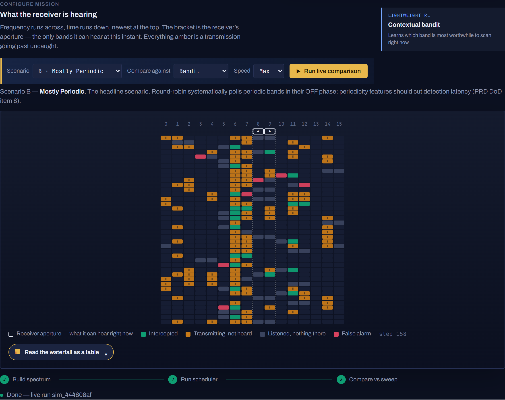
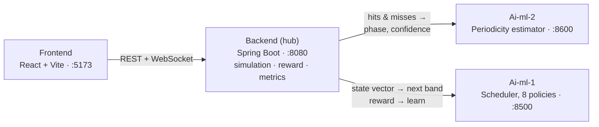
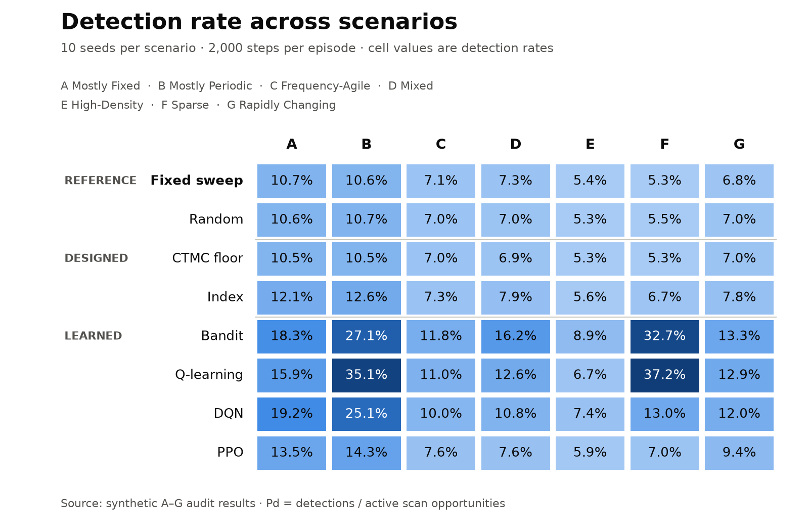
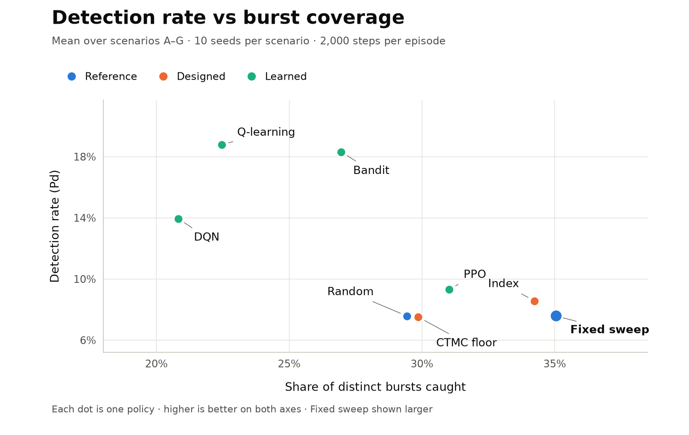
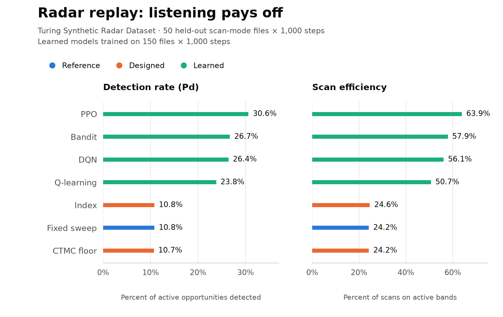
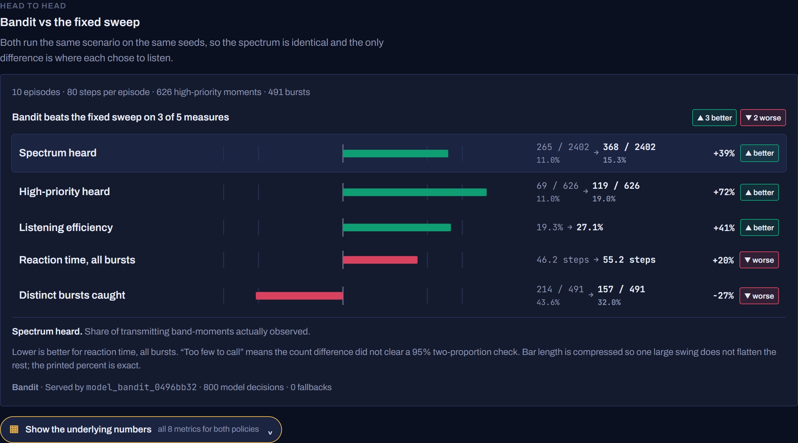

# Smart Scan Strategy for Electronic Warfare

**Smart India Hackathon · Problem Statement SIH26055 (DRDO) · Team PUSHPAK**

A wideband receiver can listen to only **2 of 16–32 frequency bands at a time**. A fixed round-robin sweep keeps walking past short transmissions. This project learns **where to listen next**: four services simulate the spectrum, estimate when periodic emitters will transmit, and let eight scheduling policies, from a fixed sweep to deep RL, compete on the same spectrum.

> Simulation only. No RF hardware, no interception, no jamming.



## How it works



Every step, the Backend:
1. advances the simulated spectrum and asks **Ai-ml-2** when each band's periodic emitter is due (phase + confidence, fitted from past hits *and* misses);
2. sends a per-band **state vector** to **Ai-ml-1**: time since last look, detection history, consecutive misses, periodicity phase/confidence, priority and tuning cost;
3. tunes the receiver to the chosen band pair, detects, and scores the step with the reward
   `r = 10·detect + 2·priority·detect − 3·latency − 5·false alarm − 8·redundant look − 4·missed high-priority`;
4. posts the reward back so the online learners update, and streams the frame to the Dashboard.

## The eight policies

| Policy | Family | How it picks the next band |
|---|---|---|
| **Fixed sweep** | Reference | Round-robin over all bands: the legacy scanner this replaces |
| **Random** | Reference | Uniformly random band |
| **CTMC floor** | Designed | Randomised random walk, so no emitter period can stay hidden from it |
| **Index** | Designed | Whittle-style index: threat × occupancy belief × P<sub>d</sub> + information gain + revisit-deadline pressure; uses Ai-ml-2's periodicity and learns each emitter's on-window from its own looks |
| **Bandit** | Learned, online | Linear contextual bandit over per-band features |
| **Q-learning** | Learned, online | Tabular Q-learning over binned band context (staleness, detection rate, periodicity) |
| **DQN** | Learned, offline | Deep Q-network, MLP 128×128 (Stable-Baselines3) |
| **PPO** | Learned, offline | Policy gradient, MLP 128×128 (Stable-Baselines3) |

## What we trained on

**Synthetic spectra: 7 scenarios, one checkpoint per policy per scenario (42 in total)**

| | A | B | C | D | E | F | G |
|---|---|---|---|---|---|---|---|
| **Character** | Mostly fixed | Mostly periodic | Frequency-agile | Mixed | High-density | Sparse | Behaviour-switching |
| **Bands / emitters** | 16 / 10 | 16 / 10 | 24 / 12 | 24 / 15 | 32 / 30 | 32 / 5 | 24 / 15 |
| **Training episode (steps)** | 2000 | 2000 | 2000 | 3000 | 3000 | 2000 | 3000 |

- **Training budget:** Bandit 20 episodes; Q-learning 40 episodes; DQN/PPO 100k / 150k / 200k steps (16 / 24 / 32 bands), with a new spectrum every episode.
- **Designed policies:** Index weights are tuned and hold-out-validated on B. CTMC is fixed.
- **Periodicity during training:** features come from Ai-ml-2's own estimator, so models see what they are served.
- **Evaluation:** all 8 policies × 7 scenarios × 10 seeds (42–51) × 2,000-step episodes, run through the full four-service loop, with zero fallback decisions.

**Real pulse data: the [Turing Synthetic Radar Dataset](https://huggingface.co/datasets/alan-turing-institute/turing-synthetic-radar-dataset)** (Alan Turing Institute; cited in the SIH26055 problem statement)

- **The dataset:** 9,000 HDF5 files, about 66 GB of pulse descriptor words. We used scan-mode files only.
- **Mapping:** RF was binned into 16 bands over 0.5–18 GHz, and pulse amplitude (PA) became per-band priority.
- **Split:** each learned model trained on 150 files × 1,000 steps; results are on 50 held-out files.

## Results

<picture>
  <source media="(prefers-color-scheme: dark)" srcset="../docs/readme/pd-heatmap-dark.png">
  
</picture>

Averaged over A–G, compared with the fixed sweep, **Bandit**:
- hears **2.4× more** of the transmitting spectrum (P<sub>d</sub> 18.3% vs 7.6%);
- spends **2× more** of its listening time on live bands (54.6% vs 27.8%);
- catches **3.5× more** high-priority transmissions (25.6% vs 7.4%).

Every scenario's best detector beats the sweep: Q-learning reaches 35% on B and 37% on F.

<picture>
  <source media="(prefers-color-scheme: dark)" srcset="../docs/readme/tradeoff-dark.png">
  
</picture>

**The honest trade-off:** learned policies concentrate on busy bands. The sweep still catches more *separate* bursts (35% vs Bandit's 27%) and intercepts them sooner on A–E. Index beats the sweep on both in F and G.

<picture>
  <source media="(prefers-color-scheme: dark)" srcset="../docs/readme/real-data-dark.png">
  
</picture>

**On real pulse data** the ranking changes:
- **PPO leads** with 30.6% P<sub>d</sub> and 63.9% efficiency, then Bandit and DQN.
- **Index and CTMC are no better than the sweep**, at about 10.8%.

**Periodicity helps (PRD DoD item 8).** Over 25 seeds on Scenario B, feeding Ai-ml-2's features to Index cuts censored intercept time by **9.2 ± 3.5 steps**. The Backend acceptance test requires that improvement to be statistically significant.



## What can be improved

- **Burst coverage:** give learned policies a revisit deadline or a reward for each *new* burst, so they stop trading distinct bursts for detection density.
- **Index configuration:** `scripts/train_all.py` drops the tuned `coverage_budget`, so Index is served with a 21-step deadline instead of the validated ~48.
- **Periodicity on shared bands:** a confident period claim on a band with several emitters slightly hurts Index on D and F.
- **Unused pulse features:** pulse width and angle of arrival in the real data could drive a threat classifier. Only timing, frequency and amplitude are used today.
- **Deployment:**
  - persistent database (H2 is in-memory);
  - authentication and origin-locked CORS/WebSocket;
  - a Backend Dockerfile;
  - publishing the trained checkpoints, which are not in git.
- **Evidence:** at least 20 seeds for every scenario. The Dashboard's 10 × 80-step race is illustrative.

## Run it locally

```bash
cd Ai-ml-1-Scheduler-Engine && uvicorn ml.api.main:app --port 8500          # scheduler
cd Ai-ml-2-Periodicity-Estimator && uvicorn periodicity.api.main:app --port 8600   # periodicity
cd Backend && mvn -DskipTests package && java -jar target/rf-scheduler-backend-1.0.0.jar   # :8080
cd Frontend && npm install && npm run dev                                     # :5173
```

Trained checkpoints are git-ignored. Rebuild all 42 with `python scripts/train_all.py` from `Ai-ml-1-Scheduler-Engine`; this takes hours. Without them, Bandit, Q-learning and Index start untrained, and DQN/PPO are unavailable.

For the details see [`RUNNING.md`](RUNNING.md) (full runbook and tests), [`API_CONTRACT.md`](API_CONTRACT.md) (service contract) and [`Ai-ml-1-Scheduler-Engine/IMPLEMENTATION.md`](Ai-ml-1-Scheduler-Engine/IMPLEMENTATION.md) (design notes). The charts regenerate with `python docs/readme/make_charts.py` from the repository root. The original build-scaffold guide for coding agents is in [`docs/build-scaffold.md`](docs/build-scaffold.md).
